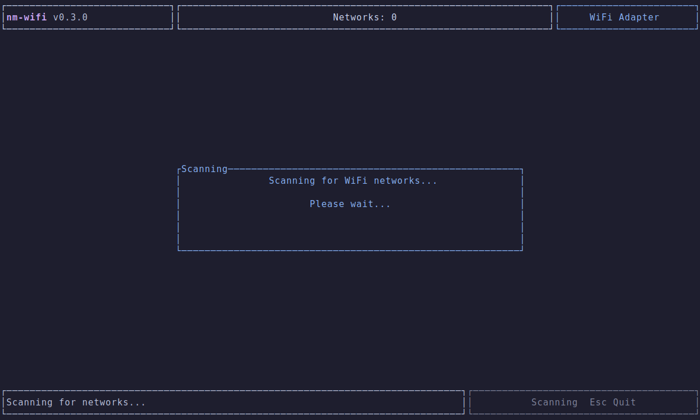
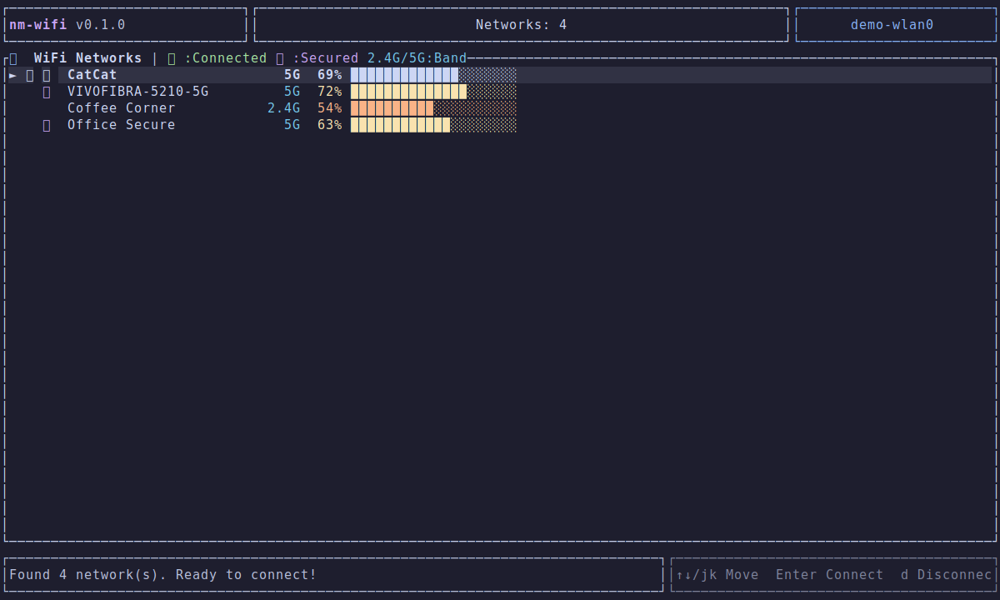
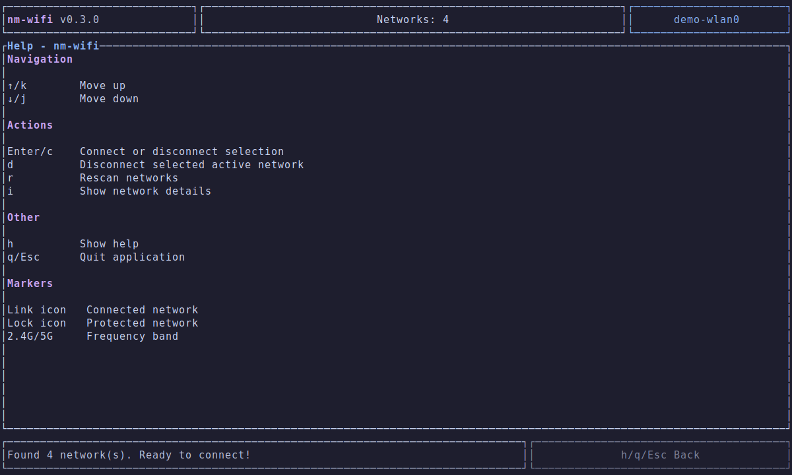
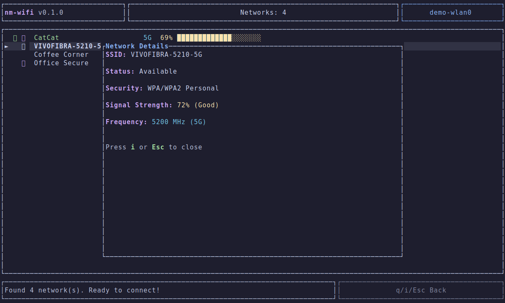
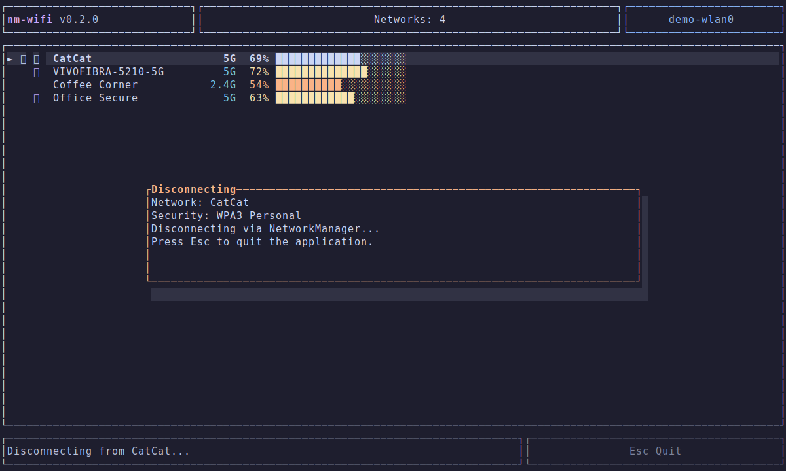
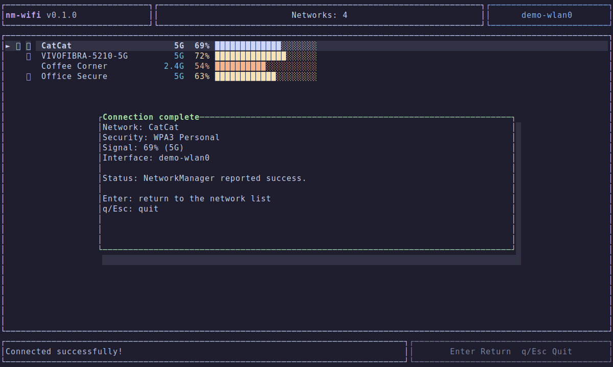
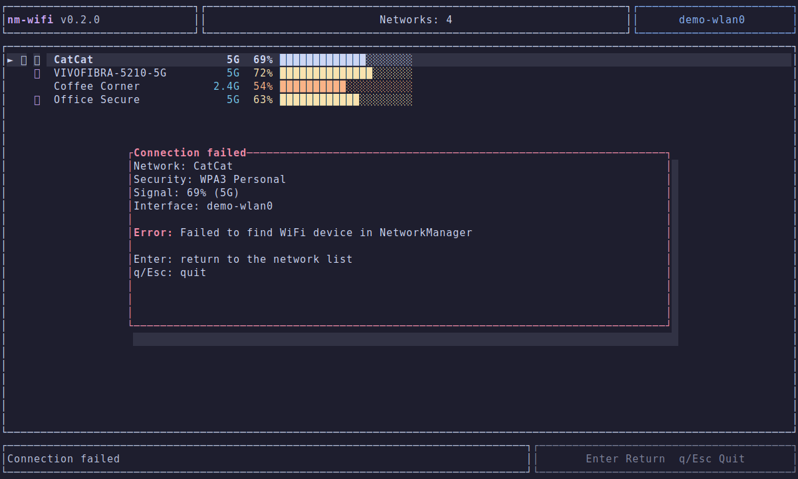

# nm-wifi

A Terminal User Interface (TUI) for scanning and managing Wi-Fi connections on Linux systems using NetworkManager.

## Features

- **Network Scanning**: Automatically scans and displays available Wi-Fi networks
- **Connect/Disconnect**: Connect to open or secured (WPA/WPA2/WPA3 Personal) networks with password support
- **Signal Visualization**: Graphical signal strength bars with color-coded quality indicators
- **Frequency Band Display**: Shows 2.4GHz, 5GHz, or 6GHz band for each network
- **Network Details**: View detailed information about selected networks
- **Vim-style Navigation**: Use `j`/`k` keys for navigation alongside arrow keys
- **Catppuccin Theme**: Beautiful Mocha color scheme for a pleasant terminal experience
- **Real-time Updates**: Live status messages during scanning and connection
- **Demo Mode**: Build with `--features demo` to run without NetworkManager or D-Bus
- **Automated Screenshot Generation**: Produce feature screenshots for the README from the demo UI

## Screenshots

### Scanning



### Network list



### Help



### Network details



### Password prompt


### Connecting


### Disconnecting



### Success result



### Failure result



## Requirements

- Linux operating system
- NetworkManager running and managing Wi-Fi
- D-Bus system bus access
- A Wi-Fi adapter

## Installation

### Using Nix (Recommended)

```bash
# Run directly
nix run github:cfcosta/nmwifi

# Or install to profile
nix profile install github:cfcosta/nmwifi
```

### Using Cargo

```bash
# Install from source
cargo install --path .

# Or build and run
cargo build --release
./target/release/nm-wifi
```

### Build Dependencies

If building from source without Nix, you'll need:
- Rust nightly toolchain
- pkg-config
- libdbus development headers (e.g., `libdbus-1-dev` on Debian/Ubuntu)

## Usage

Simply run:

```bash
nm-wifi
```

The application will automatically start scanning for available networks.

### Demo mode

Run the application without touching NetworkManager:

```bash
cargo run --features demo
```

In demo mode, scanning, adapter info, connect, and disconnect operations are mocked so you can explore the full UI safely.

### Keybindings

| Key | Action |
|-----|--------|
| `j` / `↓` | Move selection down |
| `k` / `↑` | Move selection up |
| `Enter` / `c` | Connect to selected network |
| `d` | Disconnect from connected network |
| `r` | Rescan for networks |
| `i` | Show network details |
| `h` | Toggle help screen |
| `Tab` | Toggle password visibility (in password input) |
| `q` / `Esc` | Quit application |

### Network List Indicators

- `🔗` Connected to this network
- `🔒` Secured network (requires password)
- `2.4G` / `5G` Frequency band
- Signal bar colors: Green (excellent), Yellow (good), Orange (fair), Red (weak)

## Development

### Using Nix

```bash
# Enter development shell
nix develop

# Build
cargo build

# Run with live reloading
bacon run
```

### Generate README screenshots

The screenshots in this README are generated from the demo feature flag:

```bash
cargo run --features demo --bin generate-demo-screenshots
```

This command renders the TUI into SVG files under `docs/screenshots/`.

### Rust Toolchain

The project uses Rust nightly. The toolchain is specified in `rust-toolchain.toml` and includes:
- clippy
- rust-analyzer
- rustfmt

### Project Structure

```
src/
├── main.rs              # Terminal bootstrap
├── app.rs               # Runtime controller and backend-driven flow helpers
├── app_state.rs         # Application state machine and transitions
├── backend.rs           # Shared network backend trait and factory
├── network/
│   ├── demo.rs          # Demo backend implementation
│   └── networkmanager.rs# Real NetworkManager backend implementation
├── network.rs           # Shared network request types and forwarding surface
├── demo_screenshots.rs  # Screenshot rendering pipeline
├── wifi.rs              # Wi-Fi domain models
├── ui.rs                # TUI rendering with ratatui
├── theme.rs             # Catppuccin Mocha color definitions
└── types.rs             # Compatibility re-exports for App/Wi-Fi types
```

## Technical Details

- Uses the NetworkManager D-Bus API for network operations
- `demo` feature flag swaps live NetworkManager calls for mocked responses
- Async runtime powered by Tokio
- Terminal UI built with ratatui and crossterm

## License

Licensed under either of:

- Apache License, Version 2.0 ([LICENSE-APACHE](LICENSE-APACHE) or <http://www.apache.org/licenses/LICENSE-2.0>)
- MIT license ([LICENSE](LICENSE) or <http://opensource.org/licenses/MIT>)

at your option.
